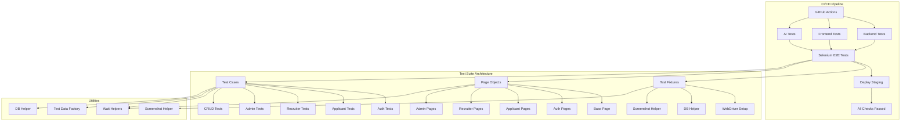
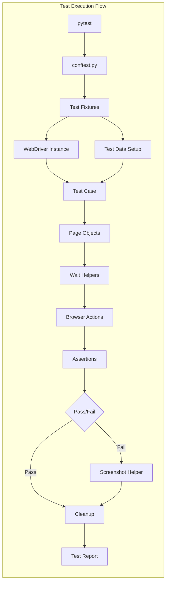

# Design Document: Selenium E2E Test Suite

## Overview

This design document specifies the architecture and implementation approach for a comprehensive Selenium-based End-to-End (E2E) test suite for CareerConnect, an AI-Powered Job Portal. The test suite will validate critical user journeys across three user roles (applicant, recruiter/employer, admin), provide regression testing capabilities, and integrate seamlessly with the existing CI/CD pipeline.

### Goals

1. **Comprehensive Coverage**: Test all critical user journeys and features across applicant, recruiter, and admin roles
2. **Reliability**: Implement robust wait strategies and error handling to minimize flaky tests
3. **Maintainability**: Use Page Object Model pattern for clean separation of test logic and page interactions
4. **CI/CD Integration**: Seamlessly integrate with existing GitHub Actions pipeline without disrupting current tests
5. **Fast Feedback**: Support parallel execution and test filtering for quick feedback cycles
6. **Debugging Support**: Provide comprehensive error reporting, screenshots, and logs for failure diagnosis

### Scope

**In Scope:**
- Selenium WebDriver-based E2E tests for web UI
- Page Object Model implementation for all major pages
- Test fixtures for WebDriver management and test data setup
- Utility modules for waits, screenshots, test data generation, and database operations
- CI/CD pipeline integration with three new jobs
- Test reporting with HTML reports and screenshots
- Parallel test execution support
- Cross-browser testing (Chrome, Firefox)

**Out of Scope:**
- API testing (covered by existing backend tests)
- Unit testing (covered by existing frontend/backend tests)
- Performance/load testing
- Mobile browser testing
- Visual regression testing
- Accessibility testing beyond basic checks
- Modification of existing test infrastructure

## Architecture

### High-Level Architecture

### Component Architecture

### Directory Structure

